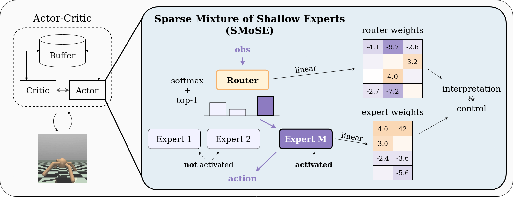

**TL;DR:** We show a down-scaled Mixture-of-Experts actor for continuous MuJoCo environments that achieves SOTA interpretable performance, matches sample efficiency, and gets near top-tier results using ~100x fewer parameters than dense models. Efficient, effective, and understandable!

# Abstract
Continuous control tasks often involve high-dimensional, dynamic, and non-linear environments. State-of-the-art performance in these tasks is achieved through complex closed-box policies that are effective, but suffer from an inherent opacity. Interpretable policies, while generally underperforming compared to their closed-box counterparts, advantageously facilitate transparent decision-making within automated systems. Hence, their usage is often essential for diagnosing and mitigating errors, supporting ethical and legal accountability, and fostering trust among stakeholders. In this paper, we propose SMOSE, a novel method to train sparsely activated interpretable controllers, based on a top-1 Mixture-of-Experts architecture. SMOSE combines a set of interpretable decision makers, trained to be experts in different basic skills, and an interpretable router that assigns tasks among the experts. The training is carried out via state-of-the-art Reinforcement Learning algorithms, exploiting load-balancing techniques to ensure fair expert usage. We then distill decision trees from the weights of the router, significantly improving the ease of interpretation. We evaluate SMOSE on six benchmark environments from MuJoCo: our method outperforms recent interpretable baselines and narrows the gap with non-interpretable state-of-the-art algorithms.

---

# Coming soon!

